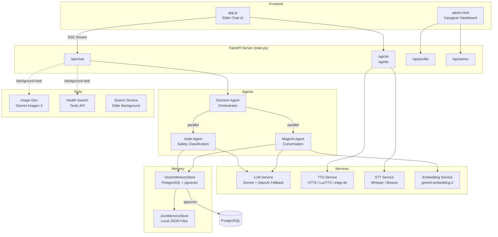
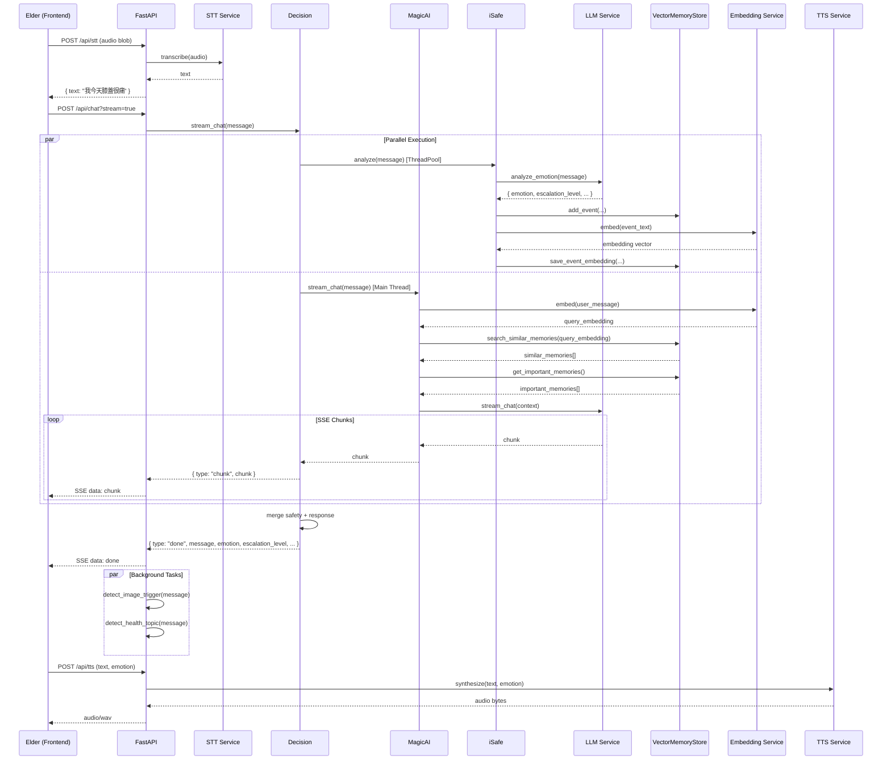

# Care4U 技術文件

> AI 長者陪伴暨照護管理系統 — 國立成功大學資訊工程學系 專題

> **詳細模組文件**：[`docs/`](docs/) 資料夾中有每個模組的實作細節、API 表、內部流程和 gotchas。本文件為架構總覽。

---

## 目錄

1. [系統總覽](#1-系統總覽)
2. [架構設計](#2-架構設計)
3. [模組詳述](#3-模組詳述)
   - 3.1 [Decision Agent（決策代理）](#31-decision-agent決策代理)
   - 3.2 [MagicAI Agent（對話代理）](#32-magicai-agent對話代理)
   - 3.3 [iSafe Agent（安全分類代理）](#33-isafe-agent安全分類代理)
   - 3.4 [LLM Service（大語言模型服務）](#34-llm-service大語言模型服務)
   - 3.5 [Memory Layer（記憶層）](#35-memory-layer記憶層)
   - 3.6 [TTS Service（語音合成）](#36-tts-service語音合成)
   - 3.7 [STT Service（語音辨識）](#37-stt-service語音辨識)
   - 3.8 [Embedding Service（向量嵌入）](#38-embedding-service向量嵌入)
   - 3.9 [Tools（外部工具）](#39-tools外部工具)
4. [資料流：一次完整對話](#4-資料流一次完整對話)
5. [資料模型](#5-資料模型)
6. [安全與認證](#6-安全與認證)
7. [設計決策與取捨](#7-設計決策與取捨)
8. [部署與環境變數](#8-部署與環境變數)

---

## 1. 系統總覽

Care4U 是一套面向台灣高齡長者的 AI 陪伴系統，提供：

- **自然語言對話**：支援國語 / 台語語音輸入，以人格化角色陪伴長者
- **安全監控**：即時情緒分析與三級分級響應，異常時通知照護人員
- **RAG 記憶**：向量搜尋 + 重要性評分，讓 AI 記住長者的故事與偏好
- **照護者管理介面**：即時監看對話、情緒趨勢、安全事件

### 技術棧

| 層級 | 技術 |
|------|------|
| 後端框架 | FastAPI + Uvicorn |
| 主要 LLM | Google Gemini 2.5-flash（對話 + 安全分類） |
| 備援 LLM | OpenAI GPT-4o-mini（Gemini 不可用時自動切換） |
| 向量嵌入 | gemini-embedding-2（3072 維） |
| 向量資料庫 | PostgreSQL + pgvector |
| JSON 儲存 | 本地檔案系統（`backend/data/elders/`） |
| 語音辨識 | OpenAI Whisper / MediaTek Breeze ASR 26（台語） |
| 語音合成 | XTTS v2（circuit breaker + auto-restart）→ edge-tts → Windows SAPI |
| 圖片生成 | Gemini Imagen 3 |
| 健康搜尋 | Tavily Search API |
| 前端 | 原生 HTML/JS + SSE 串流 |

---

## 2. 架構設計



### 核心設計原則

1. **平行執行**：Decision 使用 `ThreadPoolExecutor` 同時啟動 MagicAI（對話生成）和 iSafe（安全分類），不互相等待
2. **多層 Fallback**：每個外部依賴都有降級路徑（Gemini→OpenAI→關鍵字、XTTS→LuxTTS→edge-tts、PostgreSQL→JSON）
3. **Session 隔離**：Agent 以 `{elder_id}:{session_id}:{persona_id}` 為 key 做快取，不同長者 / 人格互不干擾

---

## 3. 模組詳述

### 3.1 Decision Agent（決策代理）

**檔案**：`backend/agents/decision.py`

Decision 是系統的「指揮官」，協調所有 agent 的執行順序。

#### 職責

- 接收使用者訊息，決定處理流程
- 平行調度 MagicAI 和 iSafe
- 合併對話結果與安全分級
- 觸發背景任務（圖片生成、健康搜尋）
- 定期排程生平更新（每 10 輪對話）

#### Agent 快取機制

```python
# 以三元組作為 key
def _agent_key(elder_id, session_id, persona_id) -> str:
    return f"{elder_id}:{session_id or 'default'}:{persona_id or 'profile'}"
```

MagicAI 和 iSafe instance 分別存於 `_magic_agents` / `_isafe_agents` dict，受 `threading.Lock` 保護。首次存取時建立，之後共用。

#### 處理流程

```
user_message
    │
    ├─ quick_keyword_check() → level 3?
    │   └─ YES → 直接回傳緊急回應，不呼叫 LLM
    │
    ├─ quick_keyword_check() → level 0 (safe)?
    │   └─ 用於決定 MagicAI 是否啟用 RAG
    │
    ├─ ThreadPoolExecutor ──┬── _run_isafe()  → safety dict
    │                       └── _run_magic()  → response text
    │
    ├─ 合併結果 + escalation 處理
    │   └─ level ≥ 2 → 附加照護人員通知文字
    │
    └─ 每 10 輪 → _schedule_biography_update()
```

#### 串流模式 (`stream_chat`)

Decision 同時啟動 iSafe（在 `ThreadPoolExecutor`）和 MagicAI streaming（在主執行緒 yield chunks）。MagicAI 的 chunk 逐一 yield 給前端（SSE），iSafe 在串流結束後以 `future.result()` 收集。

#### 人格設定

`_setup_persona()` 在 Decision 初始化時執行，從 profile 讀取 active persona，設定 TTS 引擎與聲音樣本。

---

### 3.2 MagicAI Agent（對話代理）

**檔案**：`backend/agents/magic_ai.py`

MagicAI 負責產生自然、有溫度的對話回應。

#### 職責

- 管理單一 session 的對話歷史（in-memory + disk backup）
- RAG 記憶檢索：向量搜尋相似記憶 + 重要記憶
- 呼叫 LLM Service 生成回應
- 定期觸發記憶彙整（每 10 次對話）
- 定期儲存對話歷史至磁碟（每 5 次對話）

#### 對話上下文組成

LLM 收到的 context 包含：

| 來源 | 數量上限 | 用途 |
|------|---------|------|
| `conversation_history[-4:]` | 最近 4 則 | 短期上下文 |
| `search_similar_memories()` | top 5 | RAG：與當前訊息語意相近的記憶 |
| `get_important_memories()` | top 8 | 重要性 ≥ 0.7 的長期記憶 |
| `profile` | 1 份 | 長者基本資料、生平、偏好 |
| `active_persona` | 1 份 | 當前人格（名稱、語氣、稱謂） |

RAG 先以 `EmbeddingService.embed()` 將使用者訊息向量化，再呼叫 `search_similar_memories()` 做餘弦相似度搜尋。若向量嵌入不可用，自動 fallback 到 JSON 關鍵字搜尋。

#### 對話歷史管理

- 最大保留 **50 則**，超過時截斷最舊的
- 每 5 次對話自動 `save_conversation()` 到磁碟
- 每 10 次對話呼叫 `generate_memory_summary()` 做記憶彙整
- Server 重啟時從磁碟 `load_conversation()` 恢復

#### 安全標籤過濾

重要記憶查詢時排除帶有 `安全警報` / `趨勢警報` 標籤的事件，避免這些警報內容被送入對話 prompt 影響回應品質。

---

### 3.3 iSafe Agent（安全分類代理）

**檔案**：`backend/agents/i_safe.py`

iSafe 是獨立於對話之外的安全守護層，與 MagicAI **平行執行**。

#### 三級分級響應

| Level | 含義 | 觸發條件 | 系統行為 |
|-------|------|---------|---------|
| 0 | 安全 | 日常對話 | 無特殊處理 |
| 1 | 需關注 | 情緒低落、輕微不適 | 記錄事件 |
| 2 | 需通知 | 身體症狀、高重要性 | 通知照護人員 |
| 3 | 緊急 | 跌倒、胸痛、失去意識 | 立即警報 + 跳過 LLM |

#### 關鍵字快速路徑

`quick_keyword_check()` 在 Decision 和 iSafe 中共用，提供零延遲的分級判定：

- **Level 3**（緊急）：16 個中文 + 10 個英文關鍵字（跌倒、胸痛、救命⋯）
- **Level 2**（急迫）：9 個中文 + 6 個英文關鍵字（頭暈、劇烈疼痛⋯）
- **Level 0**（安全快速路徑）：13 個中文 + 12 個英文日常詞彙，且訊息 ≤ 10 字、不含 blocker 詞彙
- **None**（需 LLM 判定）：以上都不匹配

#### LLM 分級流程

```
message
    │
    ├─ quick_keyword_check()
    │   ├─ level 0 → 直接回傳安全結果，不呼叫 LLM
    │   ├─ level 2/3 → 仍呼叫 LLM，但 keyword level 作為下限
    │   └─ None → 完全依賴 LLM
    │
    ├─ llm.analyze_emotion(message)
    │   └─ 回傳 JSON：emotion, importance, sentiment, escalation_level...
    │
    ├─ _apply_importance_rules()
    │   ├─ 緊急關鍵字 → importance ≥ 0.8
    │   ├─ 家人 / 回憶詞彙 → importance ≥ 0.7
    │   └─ importance ≥ 0.5 → should_record = True
    │
    ├─ _determine_escalation()
    │   └─ max(keyword_level, model_level)
    │   └─ Safety bump：L1 + 身體症狀關鍵字 → 自動升 L2
    │
    ├─ 語速修正
    │   ├─ slow + normal → comfort
    │   └─ fast + normal → urgent
    │
    └─ _analyze_trend()
        ├─ 連續 3 次 urgent → 緊急趨勢警報
        └─ 連續 3 次 comfort/urgent → 低落趨勢警報
        └─ 2 小時冷卻機制避免重複警報
```

#### 身體症狀自動升級

`_PHYSICAL_SYMPTOM_L2` 列表包含 20 個身體症狀關鍵字（腫、痠痛、腿軟、忘了藥、差點跌⋯）。當 LLM 判定為 L1 但訊息含這些詞時，**自動升級為 L2**。設計原則：「能重判不能輕判」。

#### 趨勢分析

維護最近 5 次情緒的 `emotion_history`，取最後 3 次：
- 全部 `urgent` → 緊急趨勢警報
- 全部 `comfort` 或 `urgent` → 低落趨勢警報

警報寫入事件紀錄，帶 `趨勢警報` tag，2 小時內同一長者不重複觸發。

---

### 3.4 LLM Service（大語言模型服務）

**檔案**：`backend/services/llm_service.py`

統一的 LLM 呼叫層，封裝 Gemini 和 OpenAI 兩個 provider。

#### Fallback Chain

```
Gemini API ──[retryable error]──▶ OpenAI GPT-4o-mini ──[fail]──▶ 關鍵字硬編碼回應
```

`_is_retryable_gemini_error()` 判斷是否為「Gemini 服務不可用」（503、429、timeout、overloaded、connection error），而非 prompt 本身的問題。只有 retryable 錯誤才觸發 fallback。

Fallback 觸發時，`_warn_fallback()` 在 server console 輸出醒目的警告橫幅。

#### 並行控制

```python
_llm_semaphore = threading.BoundedSemaphore(LLM_MAX_CONCURRENT)  # 預設 4
```

Gemini 和 OpenAI 共用同一個 semaphore，確保系統同時最多 4 個 LLM 請求。

#### 6 個公開方法

| 方法 | 用途 | Gemini 模型 | OpenAI Fallback |
|------|------|-------------|-----------------|
| `chat()` | 對話生成（非串流） | config 指定 | `_try_openai_chat()` |
| `stream_chat()` | 對話生成（SSE 串流） | config 指定 | `_openai_generate_stream()` |
| `analyze_emotion()` | 情緒 + 安全分類 | config 指定 | `_try_openai_emotion()` |
| `generate_memory_summary()` | 記憶彙整 | config 指定 | `_try_openai_simple()` |
| `update_biography()` | 生平更新 | config 指定 | `_try_openai_simple()` |
| `generate_persona_tone()` | 人格語氣生成 | config 指定 | `_try_openai_simple()` |

每個方法遵循相同 pattern：嘗試 Gemini → 判斷錯誤類型 → retryable 時嘗試 OpenAI → 都失敗時走關鍵字 fallback。

---

### 3.5 Memory Layer（記憶層）

#### VectorMemoryStore

**檔案**：`backend/memory/vector_store.py`

雙寫架構：所有讀寫操作都委派給 `JsonMemoryStore`；當 `DB_ENABLED=true` 時，事件寫入和向量搜尋同時走 PostgreSQL。

```
VectorMemoryStore
    ├── JsonMemoryStore（永遠啟用）
    │   ├── Profile CRUD
    │   ├── Conversation 歷史
    │   └── Events / Notes
    └── PostgreSQL + pgvector（可選）
        ├── elder_memories 表
        ├── embedding <=> 向量搜尋
        └── importance 重要性查詢
```

**連線池**：`psycopg2.pool.ThreadedConnectionPool`，module-level singleton，`DB_POOL_MAX` 控制最大連線數（預設 5）。

**向量搜尋**：使用 pgvector 的 `<=>` 運算子（餘弦距離），`DISTINCT ON (content)` 去重，若 PostgreSQL 無結果則 fallback 到 JSON 關鍵字搜尋。

#### JsonMemoryStore

**檔案**：`backend/memory/json_store.py`

純檔案系統的 JSON 儲存，作為 PostgreSQL 不可用時的完整替代方案。

- **路徑規則**：`backend/data/elders/{elder_id}.json`（profile）、`{elder_id}_{persona_id}_conv.json`（對話歷史）
- **原子寫入**：先寫 `.tmp` 再 `os.replace()`，避免寫入中斷造成資料損毀
- **Per-file Lock**：每個檔案一把 `threading.Lock`，不同長者的操作互不阻塞
- **事件上限**：`MAX_EVENTS = 80`，超過時保留重要性最高的 `IMPORTANT_KEEP_LIMIT = 40` 筆

#### MemoryManager（抽象層）

**檔案**：`backend/memory/memory_manager.py`

定義所有記憶操作的介面（`get_profile`, `save_conversation`, `add_event`, `search_similar_memories` 等），`JsonMemoryStore` 和 `VectorMemoryStore` 都實作此介面。

---

### 3.6 TTS Service（語音合成）

**檔案**：`backend/services/tts_service.py`

#### Fallback Chain

```
XTTS v2 ──[失敗/冷卻中]──▶ edge-tts ──[失敗]──▶ Windows SAPI
```

每個引擎的特性：

| 引擎 | 類型 | 聲音 | 延遲 | 備註 |
|------|------|------|------|------|
| XTTS v2 | 本地 HTTP | 客製化聲音克隆 | 中 | 需 GPU；circuit breaker + auto-restart |
| edge-tts | 雲端 | Microsoft HsiaoChen | 低 | 免費、無需 GPU |
| Windows SAPI | 本地 OS | 系統預設 | 極低 | 離線最終降級方案 |

#### XTTS Circuit Breaker

模組層級的斷路器，所有 TTSService instance 共享狀態：

```python
XTTS_FAIL_THRESHOLD = 2    # 連續失敗 2 次後觸發
XTTS_COOLDOWN_SEC = 120    # 冷卻 120 秒不嘗試 XTTS
XTTS_MAX_CHARS = 40        # 中文切塊上限（避免 tokenizer OOB）
```

觸發後自動呼叫 `XTTS_RESTART_SCRIPT`（PowerShell 腳本）嘗試重啟 XTTS 服務。

**三層 Emoji 防護**：LLM prompt 禁止 emoji → 後端 `_strip_emoji()` → 前端 `stripEmoji()`。防止 emoji 字元導致 XTTS tokenizer crash。

**CUDA 自動復原**：XTTS `api.py` 偵測到 CUDA 致命錯誤時呼叫 `os._exit(1)`，外層 `run_loop.py` wrapper 自動重啟進程。重啟期間所有 TTS 請求由 edge-tts 處理。背景 health probe 偵測 XTTS 恢復後立即清除 cooldown。

**GPU 序列化**：XTTS `api.py` 使用 `threading.Lock` 序列化所有推論請求，避免併發 CUDA 推論導致 tensor 維度不匹配。

#### 情緒語調對映

每種情緒有對應的語速 / 音高 / 音量參數：

| 情緒 | 語速 | 音高 | 音量 |
|------|------|------|------|
| happy | +20% | +10Hz | +5% |
| comfort | -20% | -5Hz | -5% |
| urgent | +15% | +8Hz | +15% |
| normal | +0% | +0Hz | +0% |

---

### 3.7 STT Service（語音辨識）

**檔案**：`backend/services/stt_service.py`

#### Worker Pool

`main.py` 在 startup 初始化 STT worker pool：

```python
STT_POOL_SIZE = int(os.getenv("STT_POOL_SIZE", "1"))
```

Worker 以 `asyncio.Queue` 管理借還，確保同時處理請求數不超過 pool 大小。Whisper medium 模型每個 worker 約需 5 GB VRAM。

#### 雙模型支援

| 模型 | 語言 | 用途 |
|------|------|------|
| OpenAI Whisper | 國語（zh） | 預設辨識引擎 |
| MediaTek Breeze ASR 26 | 台語（tai） | 透過 `set_language("tai")` 啟用 |

Breeze 模型採延遲載入 — 只在首次切換到台語時才下載並載入。

#### Whisper Prompt

```python
_WHISPER_PROMPT = (
    "這是台灣長者的日常對話，包含親屬稱謂如老伴、孫子、女兒、爺爺、奶奶、阿公、阿嬤，"
    "以及台灣常用詞彙如豆漿、象棋、鄧麗君。"
)
```

透過 initial prompt 引導 Whisper 對台灣長者常用詞彙有更好的辨識率。

---

### 3.8 Embedding Service（向量嵌入）

**檔案**：`backend/services/embedding_service.py`

- **模型**：`models/gemini-embedding-2`
- **維度**：3072
- Demo mode 或無 API key 時回傳 `None`，上層自動 fallback 到 JSON 關鍵字搜尋
- `embed_batch()` 目前為逐筆呼叫（已知待優化項）

---

### 3.9 Tools（外部工具）

#### Image Generation

**檔案**：`backend/tools/image_gen.py`

- 使用 Gemini Imagen 3 生成圖片
- `detect_image_trigger()` 先用 LLM 判斷訊息是否包含具體視覺場景
- 圖片生成為**背景任務**，不阻塞對話回應
- HTTP timeout 20 秒避免長時間等待

#### Health Search

**檔案**：`backend/tools/health_search.py`

- 使用 Tavily Search API 搜尋健康資訊
- `HEALTH_KEYWORDS` 對映 8 大主題：復健、用藥、飲食、睡眠、血壓、糖尿病、跌倒、失智
- `TRIGGER_KEYWORDS` 15 個觸發詞（怎麼做、如何、教我⋯）
- 健康搜尋為**背景任務**，與圖片生成同時進行

#### Search Service

**檔案**：`backend/tools/search_service.py`

- 使用 Tavily API 搜尋長者背景資料
- 用於自動豐富長者 profile（例如名人、公眾人物）

---

## 4. 資料流：一次完整對話

以下描述前端送出一則語音訊息到收到完整回應的全過程。



### 背景任務輪詢

圖片生成和健康搜尋以背景任務執行。前端透過 `GET /api/chat/background/{task_id}` 輪詢結果（每 1 秒，最多 60 次）。結果在 `chat_background_results` dict 中快取，TTL 300 秒，上限 200 筆。

---

## 5. 資料模型

### Elder Profile（JSON）

```jsonc
{
  "elder_id": "W001",
  "name": "王大明",
  "gender": "male",
  "age": 78,
  "active_persona": "ai",
  "personas": {
    "ai": {
      "name": "AI 助理",
      "honorific": "爺爺",
      "voice_engine": "xtts",
      "voice_path": "path/to/voice_sample.wav"
    },
    "p001": {
      "name": "小明",
      "honorific": "阿公",
      "relationship": "grandson",
      "voice_engine": "xtts",
      "voice_path": "path/to/grandson_voice.wav",
      "tone_instructions": "..."
    }
  },
  "biography": {
    "content": "王大明，78歲，退休教師...",
    "updated_at": "2025-01-15 14:30:00",
    "source": "auto"
  },
  "memory_summary": {
    "content": "近期主要關心膝蓋復健、孫子考試...",
    "updated_at": "2025-01-15 14:35:00",
    "based_on_events": 10
  },
  "recent_events": [
    {
      "event": "長者提到膝蓋痛，擔心無法散步",
      "sentiment": "negative",
      "importance": 0.8,
      "memory_type": "long",
      "topic_tags": ["安全警報", "需要關注"],
      "spoken_at": "2025-01-15 14:30:00",
      "date": "2025-01-15",
      "acknowledged": false
    }
  ],
  "family_notes": [
    {
      "content": "爸爸最近膝蓋不舒服，幫我多關心",
      "author": "王小明",
      "created_at": "2025-01-14 10:00:00"
    }
  ]
}
```

### PostgreSQL Schema（elder_memories）

```sql
CREATE TABLE elder_memories (
    id            SERIAL PRIMARY KEY,
    elder_id      VARCHAR(10) NOT NULL,
    content       TEXT NOT NULL,
    sentiment     VARCHAR(20) DEFAULT 'neutral',
    importance    FLOAT DEFAULT 0.3,
    memory_type   VARCHAR(20) DEFAULT 'short',
    topic_tags    TEXT[] DEFAULT '{}',
    spoken_at     TIMESTAMP,
    date          DATE DEFAULT CURRENT_DATE,
    persona_id    VARCHAR(50) DEFAULT 'ai',
    embedding     vector(3072)
);
```

### Conversation History（per-session JSON）

```jsonc
// {elder_id}_{persona_id}_conv.json
[
  {
    "role": "model",       // "user" | "model"
    "content": "爺爺，早安！今天感覺怎麼樣呀？",
    "date": "2025-01-15",
    "time": "08:30:00",
    "_rag_hits": 3         // model messages only
  }
]
```

---

## 6. 安全與認證

### 長者端

- **PIN 登入**：`issue_pin()` 產生一次性 PIN → `login_with_pin()` 驗證後發 Bearer token
- **Token 驗證**：`HTTPBearer` 中介層，`validate_token()` 檢查
- **Allowed Elder IDs**：啟動時掃描 `data/elders/*.json` + `.env` 的 `ALLOWED_ELDER_IDS`

### 管理端

- **Admin Auth**：`ADMIN_PASSWORD` 設定後啟用登入驗證
- **Demo Mode**：`CARE4U_DEMO_MODE=true` 時允許 localhost 免密碼存取
- **暴力破解防護**：`ADMIN_AUTH_MAX_FAILURES = 5` 次失敗後鎖定 `ADMIN_AUTH_LOCK_SECONDS = 60` 秒

### 輸入驗證

`backend/utils/validators.py` 提供：
- `validate_elder_id()` — 限制為 `[A-Z][0-9]{3}` 格式
- `validate_persona_id()` — 限制為安全字元
- `validate_session_id()` — 限制為安全字元

所有 API 端點的 elder_id / persona_id / session_id 都經過 Pydantic validator 處理。

---

## 7. 設計決策與取捨

### 為何選 Gemini 而非 OpenAI 作為主力？

- Gemini 2.5-pro 的中文自然度和上下文窗口（高達 1M tokens）優於同時期的 GPT-4o
- Google API 的免費額度對學生專案更友善
- 但 Gemini 穩定性偶有問題（503、rate limit），因此加入 OpenAI 作為備援

### 為何 iSafe 和 MagicAI 平行執行？

iSafe 使用輕量模型（gemini-2.5-flash），延遲約 200-500ms。若串行，會增加每次對話的感知延遲。平行執行時，iSafe 通常在 MagicAI 串流結束前就完成，不影響 TTFB。

### 為何不做 Provider 抽象層？

只有兩個 LLM provider（Gemini + OpenAI），且是學生專題。Strategy pattern 會增加不必要的複雜度。直接在 `llm_service.py` 的每個方法中 if/else 即可。

### 為何 TTS 有 4 層 fallback？

XTTS v2 提供最佳的聲音克隆品質，但需要 GPU 且偶爾不穩定。LuxTTS 是同等級替代。edge-tts 是免費雲端服務，品質可接受但無法客製聲音。Windows SAPI 是最終保底。「寧可品質降級，也不能沒有聲音」是 UX 底線。

### 為何用 JSON 檔案而非全部走 PostgreSQL？

- PostgreSQL 是可選依賴（`DB_ENABLED=false` 可完全不用）
- 本地 JSON 讓開發和 demo 不需要額外建資料庫
- 生產環境啟用 PostgreSQL 後，JSON 仍作為 fallback 和 profile 主存
- pgvector 只用於向量搜尋和事件雙寫，profile / conversation 永遠走 JSON

### Safety Bump：為何 L1 + 身體症狀 → L2？

照護系統的核心原則：**能重判不能輕判**。LLM 可能將「膝蓋腫起來」判為 L1（需關注），但實際上這是應該通知照護人員的情況。`_PHYSICAL_SYMPTOM_L2` 清單是人工策展的安全網。

---

## 8. 部署與環境變數

### 必要變數

| 變數 | 用途 | 範例 |
|------|------|------|
| `GEMINI_API_KEY` | Gemini API 金鑰 | `AIzaSy...` |
| `MAGIC_MODEL` | MagicAI 使用的模型 | `gemini-2.5-flash` |
| `ISAFE_MODEL` | iSafe 使用的模型 | `gemini-2.5-flash` |

### 選用變數

| 變數 | 預設值 | 用途 |
|------|--------|------|
| `OPENAI_API_KEY` | （空） | OpenAI fallback 金鑰 |
| `OPENAI_MODEL` | `gpt-4o-mini` | OpenAI fallback 模型 |
| `CARE4U_DEMO_MODE` | `false` | Demo 模式（免密碼 admin） |
| `DB_ENABLED` | `false` | 啟用 PostgreSQL |
| `DB_HOST` | `localhost` | PostgreSQL 主機 |
| `DB_PORT` | `5433` | PostgreSQL 埠號 |
| `DB_NAME` | `aicaeru` | 資料庫名稱 |
| `STT_POOL_SIZE` | `1` | STT worker 數量 |
| `STT_MODEL_SIZE` | `small` | Whisper 模型大小 |
| `STT_DEVICE` | `cpu` | STT 計算裝置 |
| `LLM_MAX_CONCURRENT` | `4` | LLM 最大並行數 |
| `LLM_TIMEOUT_MS` | `15000` | LLM 請求逾時（ms） |
| `XTTS_URL` | `http://localhost:8082` | XTTS 服務位址 |
| `XTTS_RESTART_SCRIPT` | （空） | XTTS 自動重啟腳本路徑 |
| `TAVILY_API_KEY` | （空） | Tavily 搜尋 API 金鑰 |
| `ADMIN_PASSWORD` | （空） | 管理員密碼 |
| `ALLOWED_ELDER_IDS` | `W001,C001,L001,Z001` | 允許登入的長者 ID |

### 啟動

```bash
pip install -r requirements.txt
cp .env.example .env
# 編輯 .env 填入 API keys
uvicorn backend.main:app --host 0.0.0.0 --port 8000
```

前端直接透過 FastAPI 的 `/static` mount 提供，開啟 `http://localhost:8000/static/admin.html` 即可使用管理介面。
