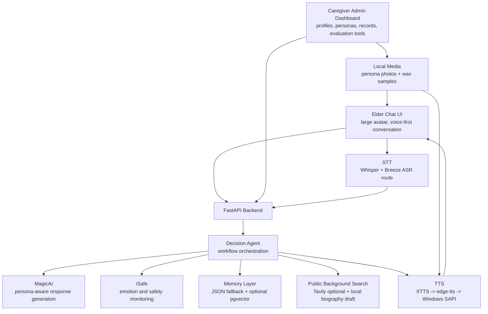

# AI Care U Poster Content Draft

Poster size: 69 cm x 104 cm, portrait. Suggested final export: PDF with embedded fonts, 300 DPI, 3 cm safe margin.

## Title Area

**AI Care U: An Elder-Centered AI Companion and Caregiver Support System**

Team member: F74124040 Yen Tzu-Yun  
Advisor: [Advisor Name]

## Problem Statement

Taiwanese long-term care settings often face two connected challenges. Older adults may need frequent emotional companionship, familiar conversation, and timely safety attention, while caregivers must monitor multiple residents with limited time and fragmented information.

AI Care U explores how an AI companion can support daily conversation without replacing human care. The system focuses on family-like companion personas, elder profile grounding, safety-aware dialogue, and a caregiver dashboard that keeps the care process understandable for non-CS users.

## Objectives

- Provide an elder-friendly chat interface with large visual elements and simple companion selection.
- Let caregivers manage elder profiles, family companion personas, photos, and voice samples.
- Detect safety-related messages such as dizziness, falling risk, pain, or emotional distress.
- Preserve important personal memories and retrieve relevant history during future conversations.
- Keep the demo resilient when external services such as Gemini, Tavily, PostgreSQL, or XTTS are unavailable.

## System Architecture

## Implementation Technologies

- Backend: FastAPI, Python, JSON-based demo storage, optional PostgreSQL + pgvector.
- AI services: Gemini for dialogue and summarization when available, fallback logic for local demo mode.
- Memory: importance scoring, long/short memory separation, profile-grounded retrieval.
- Safety: iSafe semantic safety classification and escalation levels.
- Speech: Whisper STT, Breeze ASR route verification for Taiwanese, XTTS-first TTS with edge-tts and Windows SAPI fallback.
- Frontend: static HTML/CSS/JavaScript, elder-friendly chat UI, caregiver-oriented admin dashboard.

## Results To Show

Suggested screenshots:

1. Elder chat entry screen with AI guide and family companion choices.
2. Active chat screen showing companion avatar and voice-first interaction.
3. Caregiver dashboard elder overview.
4. Companion management page with photo and `.wav` upload.
5. Safety observation page after an urgent sentence.
6. Memory RAG evaluation page showing hit rate and retrieved memories.
7. Taiwanese STT verification page with transcript/CER result.

Suggested demo metrics:

| Metric | Current Demo Status |
|---|---|
| Demo elder profiles | 3 |
| Companion personas per elder | 4 |
| TTS fallback layers | 3 |
| Safety escalation levels | 0 to 3 |
| Offline biography draft | Supported |
| RAG evaluation | Hit-rate tool available |
| Taiwanese STT | Route verified; live audio testing page available |

## Contribution

AI Care U contributes a practical prototype for AI-assisted elder companionship in Taiwanese care scenarios. The system emphasizes usability for older adults, caregiver-controlled configuration, safety monitoring, memory-aware conversation, and resilient local demonstration.

## Future Work

- Collect real Taiwanese elder speech samples and evaluate Breeze ASR transcription quality.
- Prepare authorized `.wav` samples for XTTS voice cloning.
- Evaluate long-term memory retrieval with structured caregiver/elder scenarios.
- Improve role-based admin workflows for real care teams.
- Produce final poster screenshots and demo video QR code.

## QR Code Area

Place at lower-right corner:

- Demo video QR code
- GitHub repository QR code if allowed
- Optional short URL

Keep this area visually clean and avoid placing dense text near the QR code.

